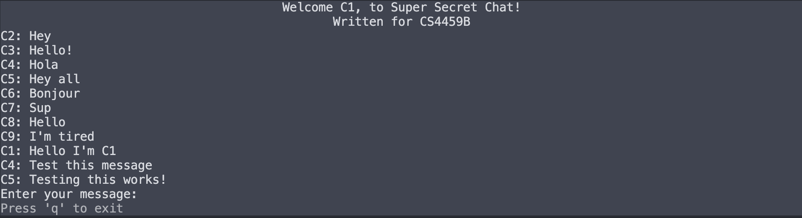

## GRPC Chatroom

This project is a GRPc based chatroom. It uses the `curses` Python library for CLI based UI, and `MongoDB` for the database.

Built for CS 4459B. Built by Gabrielle Jordan Niamat, Dhylan Usi, Satvir Uppal, Mohammed Alhasan

